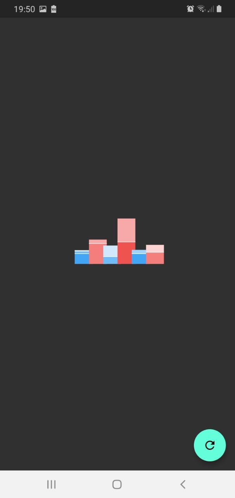
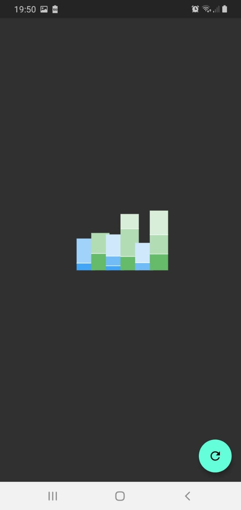
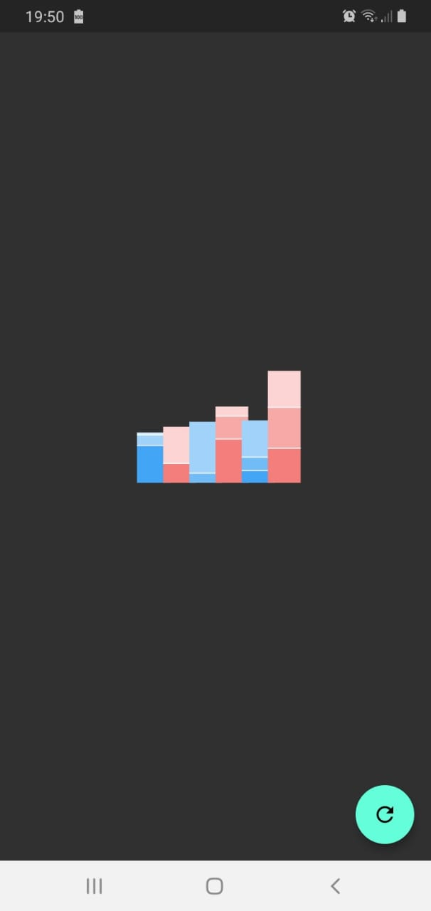

# Flutter chart animation

It's a repository for tests with Animations in flutter. I have made tests with AnimationController, Tweens, and Lerp. Further, I've added the Dark mode Theme.

## Getting Started

Download the repo

```
git clone 
```

Run flutter install on code editor

```
flutter install
```

To run the project run flutter run 

```
flutter run
```








